## COGNITIVE SERVICES

# IA

- Bot service--> es para crear boots, lo podemos meter donde sea

- Modelos prefabricados--> Cognitive services:

**por ejemplo:**

- **Translator** (Traductor).

- **Content Moderate** (sirve para detectar groserias en texto y audio).

- **Luis** --> (Comprension de lenguaje Natural).

- **Custom Vision** --> (vision computacional) es hacer que la maquina entienda imagenes o videos.

- **Anomaly detector** --> (detecta anomalias).

- **Face** --> deteccion de rostros,edad,genero y emociones.

----------------------------------------------------------------------------------------------------

Los que creamos nosotros:  nosotros mandamos datos y los resultados y la maquina solo crea reglas,

- **ML Studio** **(aprendizaje maquina)**

- **ML automatizado** 

- **Diseñador--** sirve para cuando queremos filtrar datos,

-------------------------------------------------------------------------------------------------------

## Pasos para crear un Face Recognition

1.- Vamos a crear un Notebook en ML azure

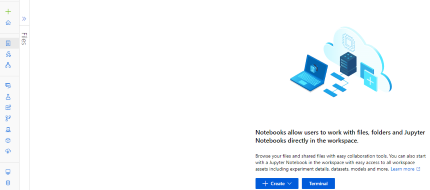

2.- Una ves adentro, donde dice **Files**, le damos en el **+** y en  crear **New File**. 

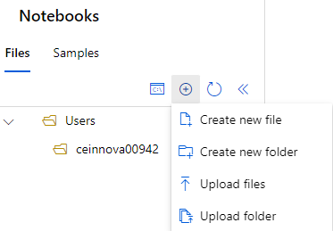

3.- Solo le cambiamos el nombre pero respetando el **.ipynb**.

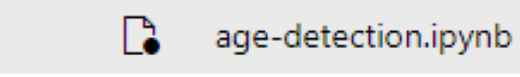

4.- Lo que haremos ahora, es copiar el link del repositorio del acordeon del profe, de la sesion 3 que dice **cara-api-consumo**.

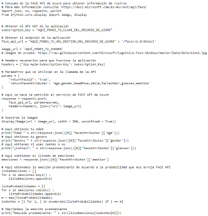

5.- Copiamos ese codigo y lo pegamos en nuestro Notebook.

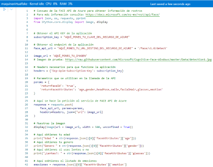

Lo que hace este codigo es mandar la informacion al API, regresar la informacion y agarrar si tiene edad, genero, que emocion tiene.

6.-  Ahora lo que haremos es ir al [Portal de Azure](portal.azure.com).

7.- Buscaremos algo llamado **Face API**.

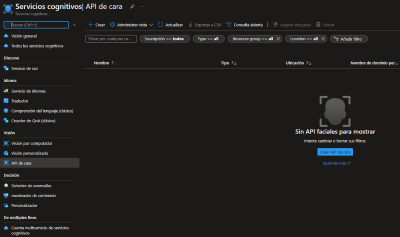

8.- Le daremos en crear y ponemos los datos que ya sabemos.

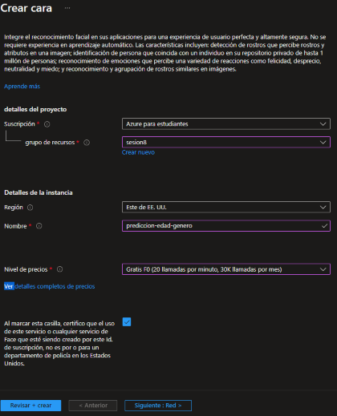

9.- Y ahora, le damos crear y esperamos a que se implemente.

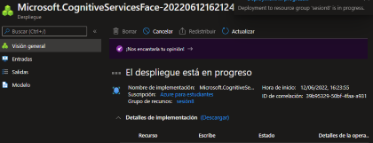

10.- Le damos en ir al Recuso y nos vamos a claves y puntos de conexion.

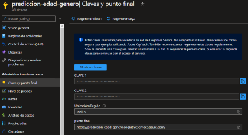

11.- Copiamos la primer clave, nos regramos a nuestro Notebook, donde dice **subscriptionkey** y pegamos la clave

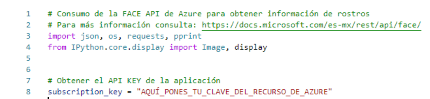

12.- Copiamos el extremo **(end point)**.

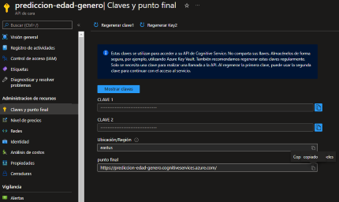

13.- Vamos de nuevo al Notebook y lo pegamos donde dice **face_api_url:**.

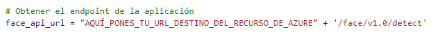

14.- Ahora para probarlo, dbemos copiar el URL de una imagen y pegarlo donde dice **image_url**.

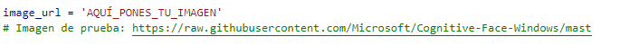

15.- Ahora pegamos el link de una imagen y le damos **run**, para que a continuacion nos muestre los resultados.

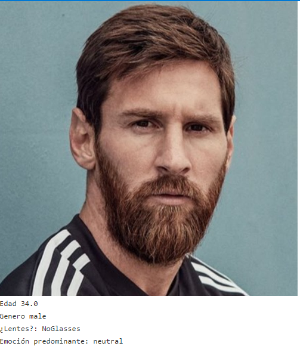

------------------------------------------------------------------------------------------------------------------------------
